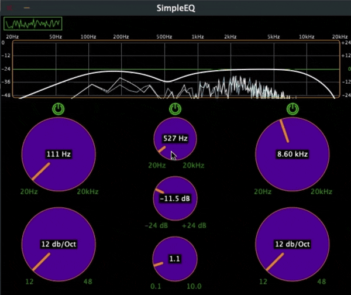

# SimpleEQ
An audio plugin written in C++ with [JUCE](https://juce.com/), featuring 3 band EQ, Response Curve, and Spectrum Analyzer. Based on Matkat Music's course with Free Code Camp. ([MatKat repo](https://github.com/matkatmusic/SimpleEQ) | [FCC video](https://www.youtube.com/watch?v=i_Iq4_Kd7Rc&t=1s\)))

